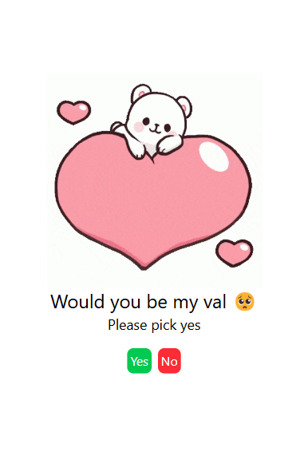
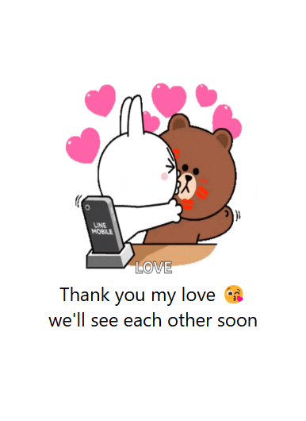

# 🥺 Would You Be My Valentine? 💘

A fun and interactive Valentine’s Day themed web app built with **Alpine.js** and **Tailwind CSS**. This web app lets you send a sweet, playful invitation to someone special. It plays through a series of fun and charming messages until the user clicks "Yes", signaling their acceptance! 💖


---

## 🚀 Live Demo

You can view the live demo of this web app here:

[**Live Demo**](https://link-to-live-demo.com)

---

## 📱 Features

- 🎨 **Beautiful and Responsive Design**: The app is built with **Tailwind CSS** for a sleek, modern look that adapts to different screen sizes.
- 💬 **Fun Messages**: Includes a series of humorous and endearing messages that lead the user toward saying "Yes."
- 🧑‍💻 **Built with Alpine.js**: The app uses **Alpine.js** for lightweight and reactive UI without needing a heavy JavaScript framework.
- 🥺 **Interactive Buttons**: Buttons change based on user interaction, and each click advances the story.
- 🎁 **GIFs**: Playful and cute animations set the mood for the fun journey ahead.
  
---

## 📸 Screenshots





---

## 💡 How to Use

1. **Clone the repository**:

```bash
git clone https://https://github.com/idehen-divine/you.git
```

2. **Navigate into the project directory**:

```bash
cd you
```

3. **Open the `index.html` file in your browser**:
   - Simply double-click the `index.html` file, and it should open in your default web browser.
   
4. **Customize the message** (Optional):
   - If you'd like to personalize the invitation message, modify the `name` query parameter in the URL like so:
   
   ```url
   http://localhost/index.html?name=YourName
   ```

5. **Share the link**:
   - Once you're happy with the message, share the link with someone special to see their reaction! 💕

---

## 🛠️ Built With

- **[Alpine.js](https://alpinejs.dev/)** – For simple JavaScript interactivity.
- **[Tailwind CSS](https://tailwindcss.com/)** – For rapid styling and a beautiful design.
- **GIF Animations** – Fun and cute animations to enhance the experience.

---

## 🤝 Contributing

Feel free to fork this repository, make changes, and create pull requests! Contributions are welcome! 🌟

To get started, please follow these steps:

1. Fork the repository
2. Create a new branch (`git checkout -b feature-name`)
3. Commit your changes (`git commit -m 'Add feature'`)
4. Push your branch (`git push origin feature-name`)
5. Open a pull request

---

## 🔑 License

This project is licensed under the MIT License – see the [LICENSE](LICENSE) file for details.

---

## 👨‍💻 Author

**[dev L0N3LY](https://github.com/idehen-divine)** – The creator of this fun and playful Valentine’s Day project.

---

### Special Thanks to:

- **Alpine.js** – For lightweight and reactive JavaScript.
- **Tailwind CSS** – For beautiful utility-first styling.
- **GIF Animations** – All the cute animations to make this app special!

---

## ❤️ Happy Valentine's Day! 🥳

---

## 🎉 Have fun, and make someone's day brighter with this playful web app! 🎉
